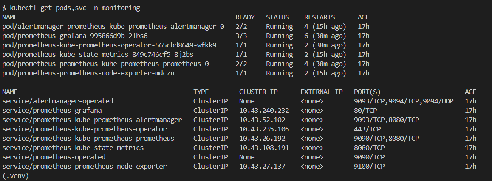
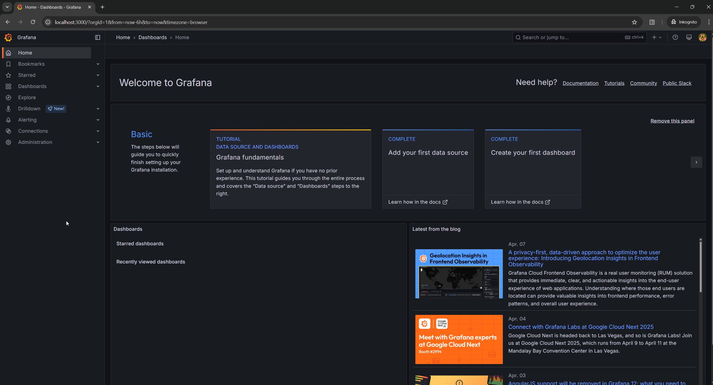
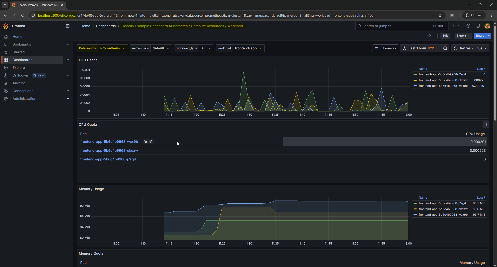
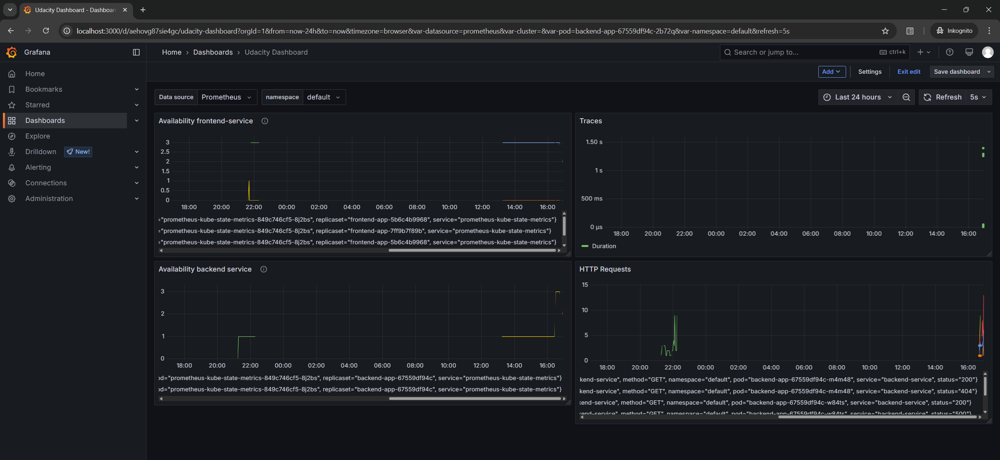
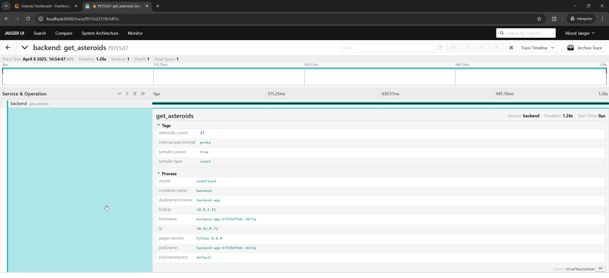
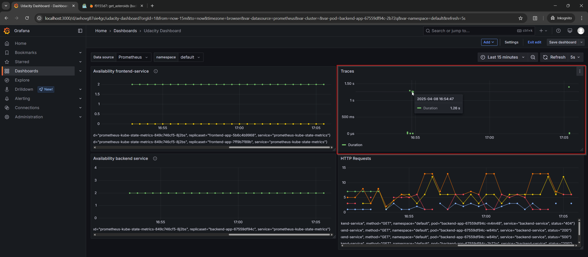
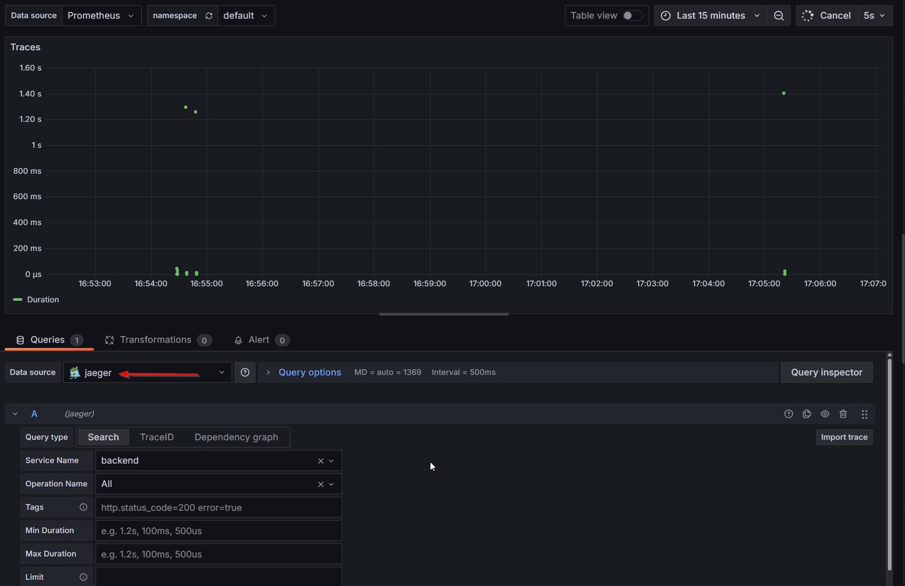
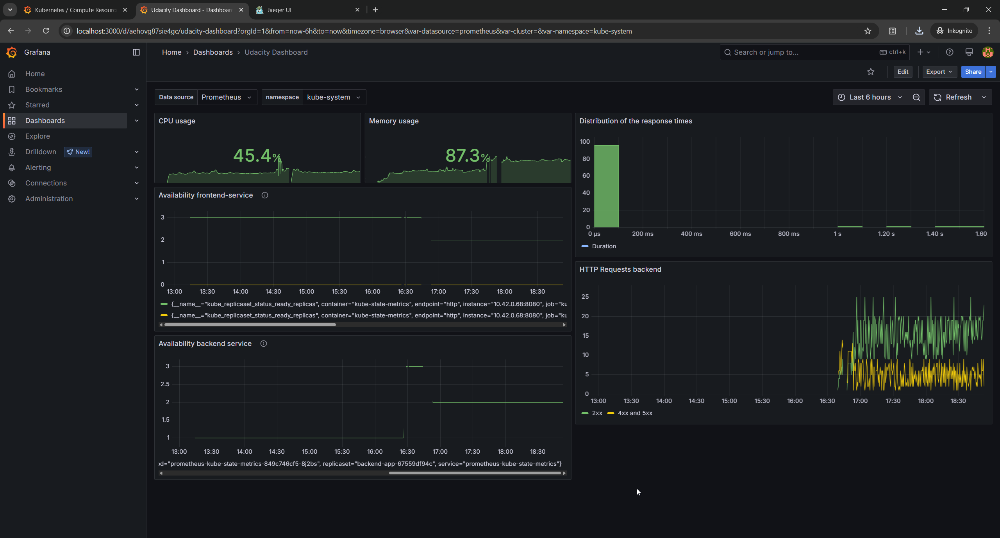

**Note:** For the screenshots, you can store all of your answer images in the `answer-img` directory.

## Verify the monitoring installation

*DONE* run `kubectl` command to show the running pods and services for all components. Take a screenshot of the output and include it here to verify the installation

answer-img/kubectl_tracing.png

## Setup the Jaeger and Prometheus source
*DONE:* Expose Grafana to the internet and then setup Prometheus as a data source. Provide a screenshot of the home page after logging into Grafana.

## Create a Basic Dashboard
*DONE:* Create a dashboard in Grafana that shows Prometheus as a source. Take a screenshot and include it here.

## Describe SLO/SLI
*DONE:* Describe, in your own words, what the SLIs are, based on an SLO of *monthly uptime* and *request response time*.

An SLO is a service level objective. It specifies the quality of service we aim for. 
Based on the monthly uptime it could be "99,9% uptime per month". If we choose request response time the goal could be "the response time must not be greater than 50ms".

An SLI is a service level indicator and measures certain aspects of the quality of service that is provided.
Examples are monthly uptime or request response time.
We can describe SLOs with SLIs like that: 
99,9% <= monthly uptime <= 100%
request response time <= 50ms

## Creating SLI metrics.
*DONE:* It is important to know why we want to measure certain metrics for our customer. Describe in detail 5 metrics to measure these SLIs.

1. Latency - It's the time taken to serve a request and usually it's measured in ms. 
It helps us to identify bottlenecks and opportunities to optimize applications.
2. Error rate - It's the number of requests that fail. We may consider all the requests that conclude with a HTTP 5xx response code. The error rate is interesting for us, because it helps us to identify application errors and scenarios where they occur. 
3. Saturation - It measures the overall capacity of a system like available CPU and free memory.
It helps us to understand the impact of our services on the infrastructure. Therefore we can take measures to optimize costs. 
4. Traffic - The traffic is the amount network requests such as HTTP or GRPC requests per second.
If we measure how much our services are requested over time, we can take measures to scale up or down accordingly.
5. Uptime - The time our services are available. This tells us if our services are healthy and ready to serve incoming requests. 

## Create a Dashboard to measure our SLIs
*DONE:* Create a dashboard to measure the uptime of the frontend and backend services We will also want to measure to measure 40x and 50x errors. Create a dashboard that show these values over a 24 hour period and take a screenshot.

## Tracing our Flask App
*DONE:*  We will create a Jaeger span to measure the processes on the backend. Once you fill in the span, provide a screenshot of it here. Also provide a (screenshot) sample Python file containing a trace and span code used to perform Jaeger traces on the backend service.

## Jaeger in Dashboards
*DONE:* Now that the trace is running, let's add the metric to our current Grafana dashboard. Once this is completed, provide a screenshot of it here.

## Report Error
*DONE:* Using the template below, write a trouble ticket for the developers, to explain the errors that you are seeing (400, 500, latency) and to let them know the file that is causing the issue also include a screenshot of the tracer span to demonstrate how we can user a tracer to locate errors easily.

TROUBLE TICKET

Name: Alexander P.

Date: 2025-04-08, 17:16 CET

Subject: 500 errors while using application

Affected Area: backend service

Severity: High

Description: Getting 500 errors. Application started to return 500 errors after it has functioned correctly. 

## Creating SLIs and SLOs
*DONE:* We want to create an SLO guaranteeing that our application has a 99.95% uptime per month. Name four SLIs that you would use to measure the success of this SLO.

1. Latency: Frontend page loading time in ms, Backend average response time in ms per hour
2. Error rate: The percentage of failed requests per hour. 
3. Saturation: The amount of free cpu and memory of the cluster
4. Traffic: The amount of requests the application handles per hour

## Building KPIs for our plan
*DONE*: Now that we have our SLIs and SLOs, create a list of 2-3 KPIs to accurately measure these metrics as well as a description of why those KPIs were chosen. We will make a dashboard for this, but first write them down here.

1. Percentage of requests that conclude successfully with a 200 response code.
    * We want to ensure that most of the user's requests are served successfully.
2. The amount of available resources on the cluster
    * We want to ensure that enough resources are available to handle the incoming requests. 
3. Average response time in ms
    * We want to ensure, that the application is responsive and the user experience is good.

## Final Dashboard
*DONE*: Create a Dashboard containing graphs that capture all the metrics of your KPIs and adequately representing your SLIs and SLOs. Include a screenshot of the dashboard here, and write a text description of what graphs are represented in the dashboard. 

CPU usage: Utilized cpu capacity on the cluster
Memory usage: Utilized memory capacity on the cluster
Distribution of response time: Histogram of the response times. 
Availability backend/frontend service: Number of available instances (pods) of the application
HTTP requests backend: Number of 2xx responses and number of 4xx/5xx responses
